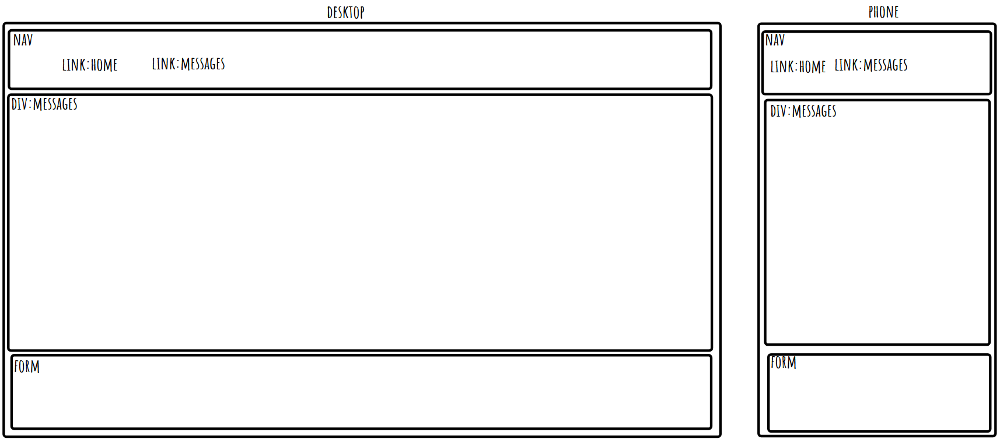

# week 7 assingment

## Reflection

- basic requirements
  User Stories

      🐿️ As a user, I want the app to be fast and responsive so that I can browse without delays.
      🐿️ As a user, I want to read and add posts so that I can interact with the community.
      🐿️ As a user, I want a simple and intuitive form for creating new posts so that the process feels effortless.
      🐿️ As a user, I want to view multiple pages so that I can easily find the content I’m looking for.
      🐿️ As a developer, I want to build a database schema and seed the database with realistic data for accurate testing and development.
      🐿️ As a user, I want to be able to view all of the posts within the database so that I can explore all available content.
      🐿️ As a developer, I want to use .map() to display all posts to efficiently display fetched data.
      🐿️ As a developer, I want to poll my database to render any new data stored in there efficiently.

Requirements

    🎯 Create a client using React.
    🎯 Use Express to create your server, using both GET and POST endpoints.
    🎯 Build a React form for users to create posts.
    🎯 Create multiple pages using React Router.
    🎯 Design a database schema, and seed the database with some realistic data.
    🎯 Use SQL to retrieve posts from the database in your Express server.
    🎯 Display all posts using .map().
    🎯 Use an interval and useEffect() to poll your database.

- stretch goals
  Stretch User Stories

      🐿️ As a user, I want to access different posts through dynamic pages so that navigation feels smooth.
      🐿️ As a user, I want to explore posts by category using dedicated routes so that I can easily find content that interests me.
      🐿️ As a user, I want to be able to delete my posts so that I can manage my content and remove anything I no longer want to share.
      🐿️ As a user, I want to like posts, increasing their like count, so that I can express my appreciation for content I enjoy.
      🐿️ As a user, I want to filter posts based on different criteria so that I can quickly find the most relevant content for me.

Stretch Requirements

    🏹 Create dynamic pages using react-router-dom.
    🏹 Use react-router-dom to create a dedicated route for the categories
        For example, /posts/:categoryName.
    🏹 Allow users to delete posts.
    🏹 Add ‘like’ functionality on posts.
    🏹 Create additional SQL queries to show filtered posts.

## References

- i use okso.app to help make a layout and site flow
- i use https://tailwindcss.504b.cc/ to help with styleing
