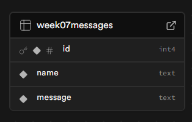
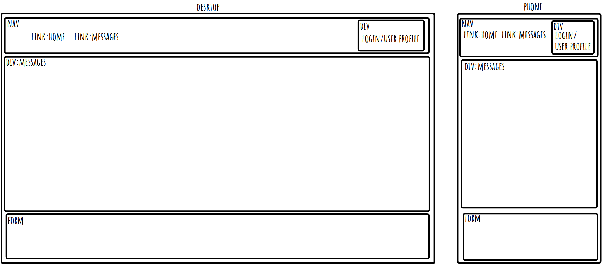
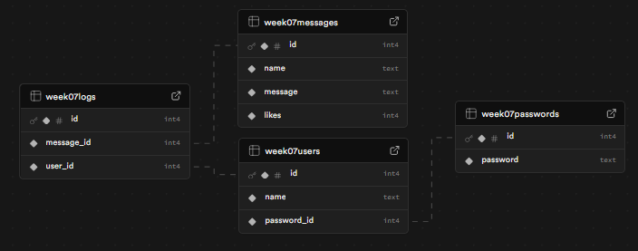

# week 7 assingment

## Reflection

- basic requirements
  
  

  - Create a client using React --done
  - Use Express to create your server --done
  - Build a React form for users to create posts --done
  - Create multiple pages using React Router --done
  - Design a database schema, and seed the database with some realistic data --done
  - Use SQL to retrieve posts from the database in your Express server --done
  - Display all posts using .map() --done
  - Use an interval and useEffect() to poll your database --done

- stretch goals
  
  

  - Create dynamic pages using react-router --done
  - Use react-router to create a dedicated route --done
  - Allow users to delete posts --done
  - Add ‘like’ functionality on posts --done
  - Create additional SQL queries to show filtered posts --nope

## References

- i use okso.app to help make a layout
- https://www.robinwieruch.de/react-router-redirect/
- https://reactrouter.com/api/hooks/useNavigate
